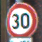
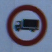
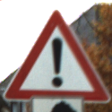
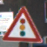

# **Traffic Sign Recognition** 

## Writeup

**Build a Traffic Sign Recognition Project**

The goals / steps of this project are the following:
* Load the data set (see below for links to the project data set)
* Explore, summarize and visualize the data set
* Design, train and test a model architecture
* Use the model to make predictions on new images
* Analyze the softmax probabilities of the new images
* Summarize the results with a written report

## Rubric Points
### Here I will consider the [rubric points](https://review.udacity.com/#!/rubrics/481/view) individually and describe how I addressed each point in my implementation.  

---
### Writeup / README

#### I use this template as a guide for writing the report. This submission includes the project code.

### Data Set Summary & Exploration

#### 1. I used Python to calculate summary statistics of the traffic signs data set:

* The size of training set is 34799
* The size of the validation set is 4410
* The size of test set is 12630
* The shape of a traffic sign image is (32, 32, 3)
* The number of unique classes/labels in the data set is 43

#### 2. Include an exploratory visualization of the dataset.

Here is an exploratory visualization of the data set. First, I randomly plot a training image. [a_random_traffic_sign](./output_images/a_random_traffic_sign.jpg)

Then I plot the histogram of training set, validation set and test set respectively.[histograms](./output_images/data_histograms.jpg) By observing the shape of the three histograms, I discover that the distribution of training set, validation set and test set is similar with minor differences. For exmple, the number of data with label 40 in the validation set is higher than the traintsng and test set. 

### Design and Test a Model Architecture

#### 1. Describe how you preprocessed the image data. What techniques were chosen and why did you choose these techniques? Consider including images showing the output of each preprocessing technique. Pre-processing refers to techniques such as converting to grayscale, normalization, etc. (OPTIONAL: As described in the "Stand Out Suggestions" part of the rubric, if you generated additional data for training, describe why you decided to generate additional data, how you generated the data, and provide example images of the additional data. Then describe the characteristics of the augmented training set like number of images in the set, number of images for each class, etc.)

As a first step, I checked the sign names on the file signnames.csv to know what the traffic signs are. Then I decided to convert the images to grayscale because the traffic signs can be recognized through their shape and the characters written on it. Here is an example of a traffic sign image (the randomly plotted training image above) after grayscaling.

[a_random_traffic_sign_in_gray_scale](./output_images/a_random_traffic_sign_gray.jpg)

In order to generate additional data for training, I decided to rotate the training image conter-clock wise 30 degree and 330 degree. The reason is that the traffic signs might not be properly put in some cases. Here is an example of a traffic sign image after rotating. 

[a_rotated_random_traffic_sign](./output_images/rotate_images.jpg)

As a last step, I normalized the image data because the all the features of image data will be in a similar range after normalization, which is good for training the DNN to learn various featurs.

#### 2. Describe what your final model architecture looks like including model type, layers, layer sizes, connectivity, etc.) Consider including a diagram and/or table describing the final model.

My final model consisted of the following layers:

| Layer         		|     Description	        					| 
|:---------------------:|:---------------------------------------------:| 
| Input         		| 32x32x1 RGB image   							| 
| Convolution 5x5     	| 1x1 stride, valid padding, outputs 28x28x20 	|
| RELU					|												|
| Max pooling 2x2	   	| 2x2 stride,  outputs 14x14x20 				|
| Convolution 5x5	    | 1x1 stride, valid padding, outputs 10x10x40  	|
| RELU					| 												|
| Max pooling 2x2     	| 2x2 stride,  outputs 5x5x40 					|
| drop out				| keep probability 0.8							|
| Fully Connected 		| Input 1000, output 320						|
| RELU					|												|
| Fully Connected 		| Input 320, output 170							|
| RELU					|												|
| Fully Connected 		| Input 170, output 43							|

#### 3. Describe how you trained your model. The discussion can include the type of optimizer, the batch size, number of epochs and any hyperparameters such as learning rate.

To train the model, I used a learning rate 0.001 to optimize the cross entropy. The optimizer applied is Adam Optimizer. I trained my model for 80 EPOCHS with BATCH_SIZE equals 128. The keep probability of drop out is set to 0.8.

#### 4. Describe the approach taken for finding a solution and getting the validation set accuracy to be at least 0.93. Include in the discussion the results on the training, validation and test sets and where in the code these were calculated. Your approach may have been an iterative process, in which case, outline the steps you took to get to the final solution and why you chose those steps. Perhaps your solution involved an already well known implementation or architecture. In this case, discuss why you think the architecture is suitable for the current problem.

My final model results were:
* training set accuracy of 0.995
* validation set accuracy of 0.934 
* test set accuracy of 0.924

Initially, I tried to use the LeNet's architecture. In order to improve the training and validation accuracy, I increase the depth of the network by increasing the depth of convolution filters. This is an important design choice. The reason is that this traffic sign dataset is more complicated than the MINIST dataset, so that more features need to be extracted for classification. In addition, drop out with keep probability of 0.8 is introduced before the fully-connected layer to generalize the training model for prediction. The value of learning rate and epoch is selected after some experiments.

### Test a Model on New Images

#### 1. Choose five German traffic signs found on the web and provide them in the report. For each image, discuss what quality or qualities might be difficult to classify.

Here are five German traffic signs that I found on the web:

The images are selecte of different traffic sign classes.
The first image might be difficult to classify because its shape is not round on the image.
The second image might be difficult to classify because the brightness of sign and the background is similar.
The third image might be difficult to classify because there is another sign rectangular close to the bottom of the sign.
The fourth image might be difficult to classify because there is another sign rectangular on the left side of the sign.
The fifth image might be difficult to classify because there is a very bright spot on the left down side of the sign. 

#### 2. Discuss the model's predictions on these new traffic signs and compare the results to predicting on the test set. At a minimum, discuss what the predictions were, the accuracy on these new predictions, and compare the accuracy to the accuracy on the test set (OPTIONAL: Discuss the results in more detail as described in the "Stand Out Suggestions" part of the rubric).

Here are the results of the prediction:

| Image									   | Prediction								 | 
| :---------------------------------------:| :-------------------------------------: | 
| Speed limit (30km/h) 					   | Speed limit (30km/h) 					 | 
| Vehicles over 3.5 metric tons prohibited | Vehicles over 3.5 metric tons prohibited|
| General caution						   | General caution						 |
| Traffic signals     					   | Traffic signals						 |
| Keep right							   | Keep right								 | 

The model was able to correctly guess 5 of the 5 traffic signs, which gives an accuracy of 100%. This compares favorably to the accuracy on the test set because the features of all the online images collected here can be extracted well on the trained model. The test set contains images whose features can not be extracted well on the trained model.

#### 3. Describe how certain the model is when predicting on each of the five new images by looking at the softmax probabilities for each prediction. Provide the top 5 softmax probabilities for each image along with the sign type of each probability. (OPTIONAL: as described in the "Stand Out Suggestions" part of the rubric, visualizations can also be provided such as bar charts)

Because the images collected are of relatively good quality, they are classified with the right label with a probability of 1.0

For the first image, the model is sure that this is a Speed limit (30km/h) sign (probability of 1.0), and the image does contain a Speed limit (30km/h) sign. The top five soft max probabilities were all speed limit signs:

| Probability			| 		Prediction									| 
|:---------------------:|:---------------------------------------------:	| 
| 1.0					| (1) Speed limit (30km/h)							| 
| 1.13910999e-26     	| (4) Speed limit (70km/h)							|
| 4.22546081e-29        | (0) Speed limit (20km/h)							|
| 8.92817770e-31        | (2) Speed limit (50km/h)					 		|
| 5.60311284e-33		| (5) Speed limit (80km/h)							|

For the second image, the model is sure that this is a Vehicles over 3.5 metric tons prohibited sign (probability of 1.0), and the image does contain a Vehicles over 3.5 metric tons prohibited sign. The top five soft max probabilities were: 

| Probability			| 		Prediction									| 
|:---------------------:|:---------------------------------------------:	| 
| 1.0					| (16) Vehicles over 3.5 metric tons prohibited		| 
| 9.03129795e-28		| (4)  Speed limit (70km/h)							|
| 1.70379781e-30		| (9)  No passing									|
| 3.98991324e-31		| (1)  Speed limit (30km/h)			 				|
| 6.64407040e-33		| (41) End of no passing 							|

For the first image, the model is sure that this is a General caution sign (probability of 1.0), and the image does contain a General caution sign. The top five soft max probabilities were:

| Probability			| 		Prediction									| 
|:---------------------:|:---------------------------------------------:	| 
| 1.0					| (18) General caution								| 
| 0.0					| (0)  Speed limit (20km/h)							|
| 0.0					| (1)  Speed limit (30km/h)							|
| 0.0					| (2)  Speed limit (50km/h)			 				|
| 0.0					| (3)  Speed limit (60km/h)							|

For the fourth image, the model is sure that this is a Traffic signals sign (probability of 1.0), and the image does contain a Traffic signals sign. The top five soft max probabilities were: 

| Probability			| 		Prediction									|
|:---------------------:|:---------------------------------------------:	| 
| 1.0					| (26) Traffic signals								| 
| 4.53945978e-11		| (18) General caution								|
| 1.06697441e-30		| (24) Road narrows on the right					|
| 2.31487972e-33		| (27) Pedestrians			 						|
| 3.18355467e-35		| (13) Yield 										|

For the fifth image, the model is sure that this is a Turn right ahead sign (probability of 1.0), and the image does contain a Turn right ahead sign. The top five soft max probabilities were:

| Probability			| 		Prediction									| 
|:---------------------:|:---------------------------------------------:	| 
| 1.0					| (38) Turn right ahead								| 
| 6.88735407e-16		| (20) Dangerous curve to the right					|
| 2.53158924e-17		| (23) Slippery road								|
| 2.55267834e-19		| (10) No passing for vehicles over 3.5 metric tons	|
| 3.29413564e-20		| (25) Road work									|

### Discussion
For this solution, the training set accuracy is 0.995 and validation set accuracy is 0.934. The difference between training set accuracy and validation set accuracy is 6%, which indicates overfitting. A quick guess is that using all RGB information of images would results a better trained model than using grayscale images. In addition, different methods need to be tried to improve it in future. One possible way would be designing a different network architecture that works very well on this problem. Another way would be developing different ways to finetune the existing model with more additionaly generated data.  

### (Optional) Visualizing the Neural Network (See Step 4 of the Ipython notebook for more details)
#### 1. Discuss the visual output of your trained network's feature maps. What characteristics did the neural network use to make classifications?

